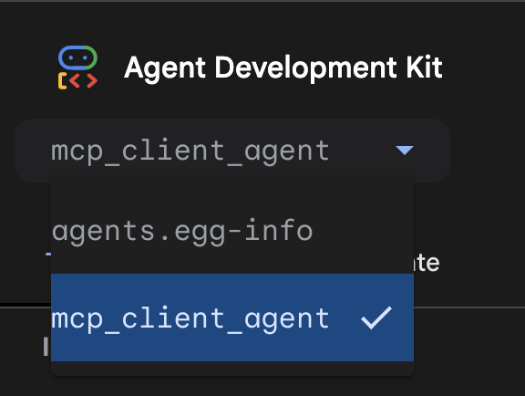

# ADK Demo Agents

## Running the MCP Client Agent 
An example MCP client agent that uses an MCP server deployed to Cloud Run, secured by authentication, requiring an identity token to access.

This tutorial is based off of the Codelab provided here: https://codelabs.developers.google.com/codelabs/cloud-run/use-mcp-server-on-cloud-run-with-an-adk-agent#0

### Prerequisite Setup in your GCP Project

This agent depends on an MCP Server deployed to Cloud Run within your Google Cloud project. You can follow the tutorial at the link provided to deploy the [MCP Server on Cloud Run](https://github.com/vishal84/mcp-server-cloud-run).

Once your Cloud Run MCP Server is deployed, to use the **MCP Client Agent** example, you must first register an application with your OAuth 2.0 provider. Google Cloud can provide OAuth 2.0 support for applications and is used in this tutorial. To register an OAuth 2.0 application do the following:

1. Navigate to your Google Cloud project and select __Left Menu__ > __APIs & Services__ > __OAuth consent screen__.

2. Click __Get Started__.

3. Give your application a name i.e. `MCP Client Agent` and supply an email address. Click __Next__.

4. Select `External` for the Audience. Click __Next__.

5. Use the same email address for the __Contact Information__ section and click __Next__.

6. Select the `I agree` checkbox and click __Continue__.

7. Click __Create__ to finish the OAuth consent setup.

Once OAuth 2.0 consent has been established in your Google Cloud project you can register an OAuth 2.0 client.

1. Navigate to __Left Menu__ > __APIs & Services__ > __Credentials__.

2. At the top select __OAuth client ID__ from the input dropdown __Create credentials__.

3. Set the application type to __Web Application__ and give the client a name i.e. `MCP Client Agent`.

4. Add the following two URLs to the __Authorized redirect URIs__ section:

* http://127.0.0.1:8000/dev-ui/

The  URI above allows ADK Web (the development UI for ADK agents) to receive OAuth redirects and exchange an auth code for a token.

5. Click __Create__. 

In the resulting popup dialog __OAuth client created__ copy the __Client ID__ and __Client secret__ values and note them down for use later.

### Create the MCP Client service account

In this example, a service account is used to establish connectivity to the MCP Server deployed to Cloud Run from the MCP Client Agent. To create the service account required:

1. Navigate to __Left Menu__ > __IAM & Admin__ > __Service Accounts__.

2. Click on __Create service account__ and give it the name provided below:
```
mcp-server-sa
```

3. Optionally provide a description for the service account and click __Create and continue__.

4. Click __Done__ to finish creating the service account.

You will need to add required permissions to the service account for it to perform the actions required by the agent:

1. In the __Actions__ column click the `...` elipses and select __Manage permissions__.

2. Click the __Manage Access__ button and add the following three roles to service account in the __Assign roles__ modal:

* `Vertex AI User`
* `Cloud Run Invoker`
* `Logs Writer`

Click __Save__.

3. Click on the __Keys__ tab (next to the Permissions tab) of the service account.

4. Select the __Add key__ drop down > __Create new key__.

5. In the resulting modal dialog ensure `JSON` is selected then click __Create__. Give the file a familiar name such as `mcp-server-sa.json` and select the location to download the key file to your local machine. Note the path to the service account file as it will be used when starting the agent locally.

### Running the MCP Client Agent locally with `adk web`

To run the `mcp_client_agent` locally for development, from the project root run the following:

1. Place the service account key file downloaded earlier in the `/scripts` directory. Then navigate to the `/scripts` directory from the project root. You will need to enter the `OAUTH_CLIENT_ID` and `OAUTH_CLIENT_SECRET` created earlier into this file to run the sample as well as other required project variables including the `GOOGLE_CLOUD_PROJECT` and `GOOGLE_CLOUD_LOCATION` variables:

```bash
cd scripts/
chmod +x set_env.sh
source set_env.sh
```

2. Navigate to the `/agents` directory from the project root and run `uv sync` to install agent dependencies:
```bash
cd ../agents/
uv sync
```

### Start the MCP Client Agent using `adk web`
To run the agent run the following command:

```bash
uv run adk web
```

4.  After the server starts up you can access the `/dev-ui` for `adk web` at:
```
http://127.0.0.1:8000/
``` 

5. Once `adk web` loads, select the `mcp_client_agent`  from the top drop down to begin a session.



export GOOGLE_APPLICATION_CREDENTIALS=~/.config/gcloud/application_default_credentials.json